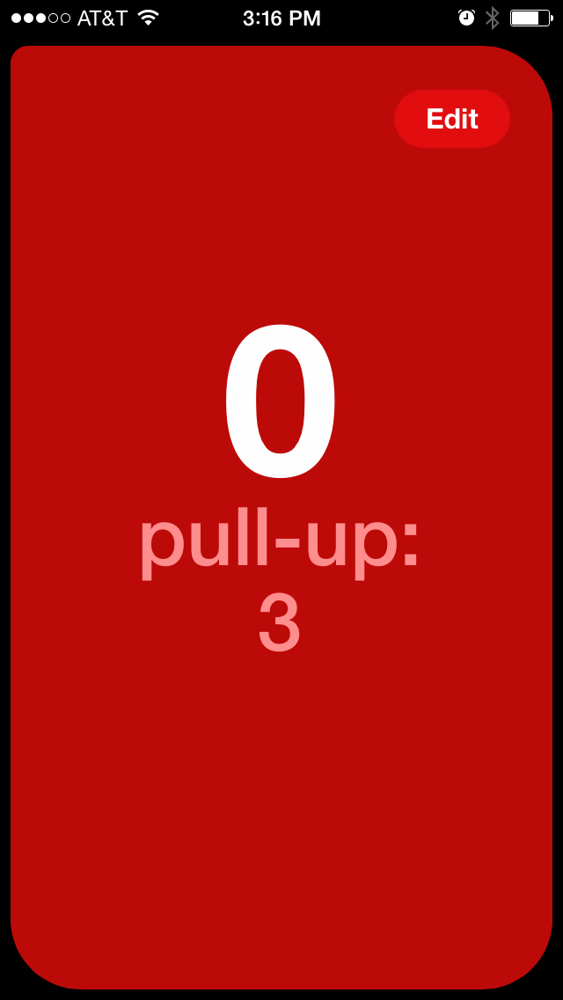
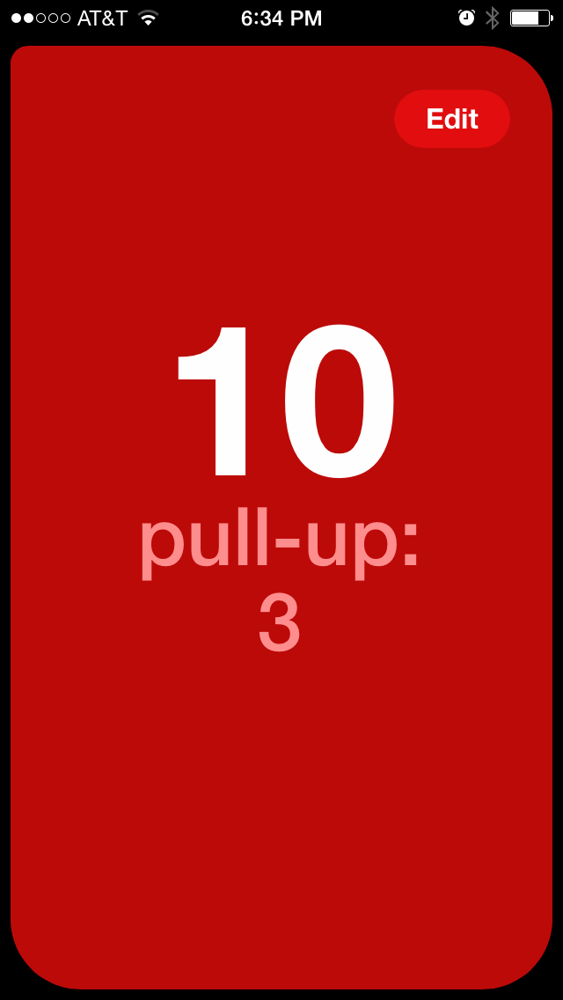

# Description of Fitness Tracking by Bean Counting

You only need two things to get better at some aspect of fitness:

* A test.
* A repeating action that makes you better at the test.

Given those, tracking your fitness is as easy as counting.

Let's say you want to get better at pull-ups. One good way to fill out the above template then is:

* Test: Max pull-ups in one set.
* Action: One exercise, the pull-up.

I call this test/action pair a bean. Tracking is so simple you can do it with a 99 cent paper pocket notepad. However, most of us have smart phones and you can download a counting app that will make things even a little nicer. I use one for the iPhone called Bean.

Starting out, you do your test. Let's say you can do 3 pull-ups in one set. This is how your new bean looks.

The label has the exercise and your personal record (PR) for the fitness test, in this case 3 reps. The counter is set to 0 because you haven't gotten any beans yet. After setting the PR, you can start getting beans right away. Let's say you do 10 more reps in the work-out. Now your bean looks like this:

It doesn't matter if you do 1 at a time or 2 at a time or 2-1-4-3-3 or any other pattern you want. All that matters is that after each set, you tapped off however many you did in the counter. That's how much work you've made toward your next PR.

In a couple days you workout again. You decide to try to test for a PR again. You can choose to PR whenever you want. If it's psychologically intimidating, there's no harm in waiting until you're sure you can pass. Alternatively, the worst thing that can happen in going for a PR is that you get some more beans. In this case, you get half-way up on a 4th pull-up, but don't make it. So you're still at 3 max reps in a set. You decide to do 7 more reps also, so including the 3 reps from the PR attempt, you're up to 20 beans.

A bean can refer to a test/action pair or it can refer to the action counts, e.g., a set or a rep or a workout. I like to call it something funny cos it's fun and also it's a little more precise in describing the concept it refers to.

One nice thing is you don't feel as much anxiety about whether you're making progress toward your PR. You can always glance at your counter and see how much work you've put in, and barring very poor nutrition or illness, you know it's just a matter of getting enough beans before you PR again.

Counting is very simple to implement gamification of something that is otherwise to dull to keep doing or difficult to keep focused on improvement. Gamification has become such a buzzword recently because it works.

Counting takes the pressure off of sets. If you don't feel like getting 6 reps on every set, you don't have to. 

You don't feel punished for not following a scheme.

You get credit for every bit of progress you make toward a PR.

Ironically, focusing on beans lets you focus on the deliberate practice of getting better at an exercise, rather than feeling bullied into following a rep/set scheme. It places the emphasis on a training session in a better place. 

You feel in control as you develop a sense of how many beans it takes to PR and knowing that you've locked in the gains needed to PR

You can make fitness as complex as anything. The number of measurements you could take to track your exercise program is virtually limitless, but unless you have Drago from Rocky 3's Soviet sport science team at your back, tracking too many things is impractical. But often in life, if you can figure out some sensible constraints to live within, it can make you much more efficient and powerful.

Start with 3 examples: a normal person, and old person, an athletic person.

Practically every fitness scheme you've ever seen is merely a recipe to get you to do enough stuff in the training range to improve a test. Often the test is ambiguous or unspecified, but the test is there. You're supposed to get better (or at least not get worse, or at the very least slow the rate of getting worse) at some aspect of fitness that could, theoretically, be measured. Set/rep schemes are one way to motivate you to do enough work, but fundamentally, training an aspect of fitness is the same as any other deliberate practice: The more you do, if you're doing the right things, the better you get. Unless you overtrain, but most people don't have the discipline to overtrain.

Understanding that doing all your reps with a set scheme, or even at the same time, is not necessary to get stronger. You can do 2 reps one set, rest 3 minutes, do 1, rest 5 minutes, do 5, rest 30 seconds, do 2 and it will still work. You don't have to do 3 sets of 5, or whatever. The cumulative effect is what matters for strength. And we can extend this analogy to conditioning work, where many types of conditioning program designs will lead to increased conditioning. You can do 1/2 hour of aerobics, or 6 five minutes sessions in intervals. There will be some differences in the effect, almost certainly not noticeable to the athlete.

Now, if you're an Olympic or professional athlete who has the luxury of devoting their entire waking life to training, then making some parts of your program strict in its arrangement might be of some benefit. I don't automatically grant that, but it's possible. Even among Olympic athletes, though, you'll find a more skill acquisition based approach to an exercise. A gymnast will attempt a dismount from a bar, study it, get some coaching, try again. Broz Knows athletes do the same thing for something as simple as a squat. An exercise movement is just a skill, to be improved by deliberate practice, not magic set/rep schemes.

And for conditioning work, some advanced competitive conditioning athletes, particularly marathon runners will need a specific program design. But for most athletes, playing your sport is the best conditioning work, and there is not danger to your body or results in counting your conditioning work the way there can be for long distance runners. I used to play basketball 6 hours a day every day for weeks and every additional hour I played, the fitter I got. Unless you are planning on running for signficantly longer than that, counting your condition is as safe and effective as counting your other fitness factors.

It's true that fitness adaptations will include more than nervous system changes in some cases, such muscle fiber adaptations to store more ATP. This is even true for muscles adapting to play the piano at top speeds, though. Physical skills always require a combination of nervous and musculoskeletal adaptations. By conflating all adaptations under the skill rubric, even though the abstraction is not perfect, what we gain in power and flexibility for program design and tracking is well worth it. It is easy to apply counting to any fitness aspect, with a little thought, even bodybuilding and metabolic conditioning.

What gets measured gets done, said Peter Drucker. That quote contains both a point of great power and a warning. If you measure the wrong thing, that thing will be optimized. But the only reason that warning is so important is because measuring things is so powerful. What gets measured WILL get optimized.

I haven't thought of and thus had to apply counting to every fitness situation, but I've applied it to quite a few, and there's always a way to adapt it to the circumstances at hand and making the effort to do so gets you all the benefits of super simple tracking and hyper goal focus.

The main reason people fail on getting really fit is not having a good test and losing track of their progress against this test. Research shows that weighing yourself everyday, for example, makes you much more likely to lose weight on a diet. Without a tracked test, people have a tendency to rationalize their progress. They don't realize or want to admit to themselves that they're only yoyoing in a range of fitness rather than having the compound results they could attain with focus. Not extreme effort, just focus. Focus is hard. Counting makes it trivial.

What to do if you get sick or have to take a break for any other reason.

Add pages for specific program templates: Older person maintaining strength, basic strength, strength + conditioning, athleticism, only squats, how to lose weight with counting?

Any complex system of tracking will eventually be dropped. Tracking must be so simple that it couldn't be any simpler. It has to be so simple that if you stop for awhile, you remember still how it works. And tracking has to feature the single or handful of fitness factors to be improved.

Not everything has to be tracked or should be tracked. Only the minimal set of fitness aspects that you want to maintain as the baseline or skeleton of your fitness. Tracking these, you can be confident of a minimal level of fitness or fitness progress. I don't need to track shooting a basketball. I deliberately practice my basketball shot because it's fun. Tracking is for those things you probably wouldn't do on your own, or maintain, or get better at, but that are still important.

Let's you choose what's fun or important on a moment to moment basis. Prioritizes by using the awesome intuitional power of the brain to understand what's important and motivating in context.

Using this method, I've been able to fully focus on work, including working lots of OT, and still make PRs, something I've never been able to do before. Not only that, but it's easy and stress free.

Intermixing exercises becomes easier. You can do squats and bench press at the same time if equipment allows.

You can stop a set at any time if you're counting reps.

Fitness goals scale and up down according to time and motivation. Always know which beans are the most important from first to last.

By cutting down the tracking to bare essentials, you're forced to confront what goals are important and whether you're putting in enough work to get better.

Even if some other plan is theoretically more optimal, the law of diminishing returns says it's probably not by much.

You can tell your son to get his beans in public and you aren't revealing anything embarrassing or private to bystanders. 

You can still use a rep/set scheme if you want, but use counting to track the main work.

The fact that you can get beans at any time can inspire creative ways to get extra.

If you aren't getting beans every day or aren't so excited that you're checking your beans and keeping it top of mind, you may need an aid to make sure you're getting beans regularly. This can be a simple calendar on the fridge in which you mark an X every day that you get beans.